# LoungeCat IRC Client

**LoungeCat** is a modern, feature-rich IRC client built for Linux and Windows. It combines the power of the traditional IRC protocol with a sleek, contemporary user interface designed for productivity and ease of use. Built with Kotlin and Jetpack Compose, it offers a responsive and fluid experience.

## ✨ Key Features

### 🎨 Modern User Interface

- **Sleek Design**: A clean, material-inspired interface that feels at home on modern desktops.
- **Theming Support**: Includes **Dark** and **Light** themes to suit your preference.
- **Responsive Layout**: Fluidly adapts to different window sizes.
- **Split View**: View multiple channels side-by-side. Right-click any channel to "Open in Split View" for efficient multitasking.
- **Drag & Drop**: Easily reorganize server and channel tabs with intuitive drag gestures.
- **Single Instance Lock**: Prevents accidental multiple instances of the application.
- **Rich Media**:
  - **Inline Image Previews**: Automatically displays previews for image links (can be toggled).
  - **Formatted Text**: Full support for IRC colors, bold, italic, and underline (mIRC codes).

## 📸 Screenshots

### 🎭 Themes

| | | |
|:---:|:---:|:---:|
| 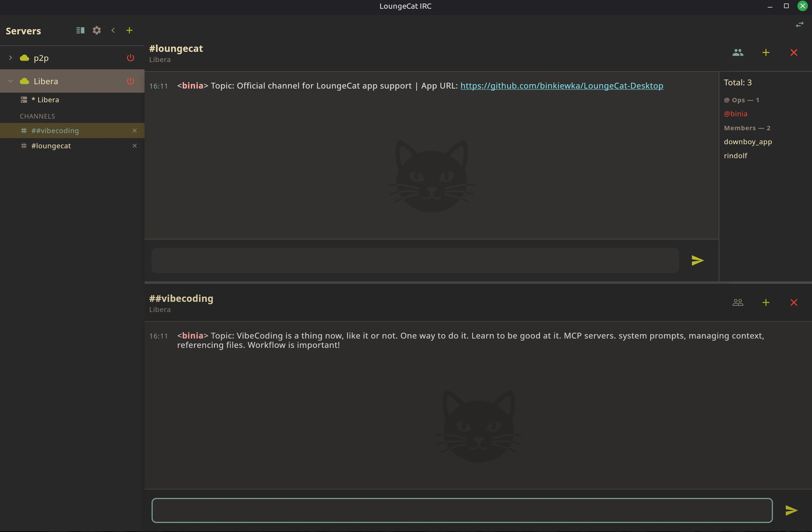 | 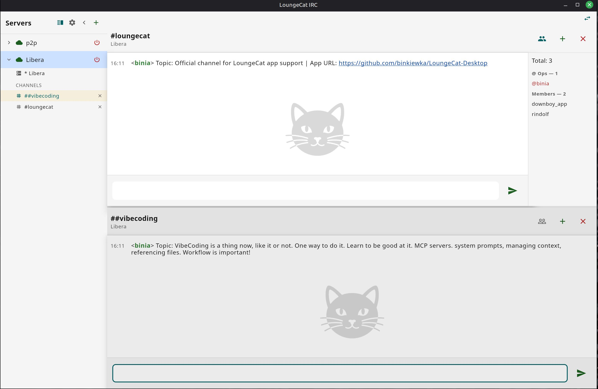 | 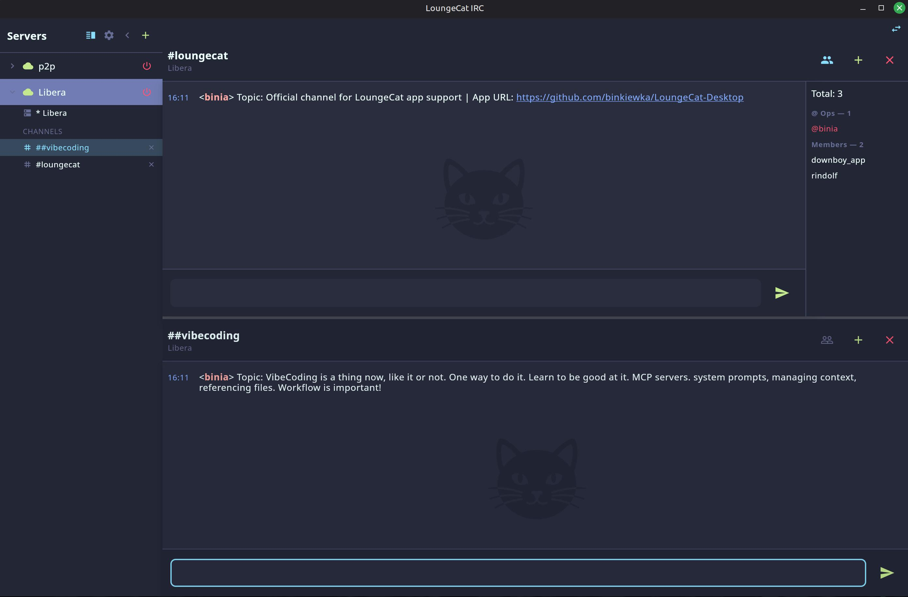 |

### 🖥️ Split View

| | | |
|:---:|:---:|:---:|
| 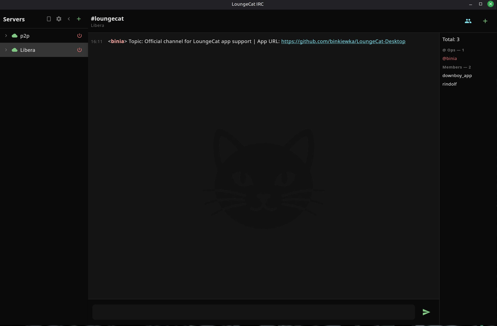 | 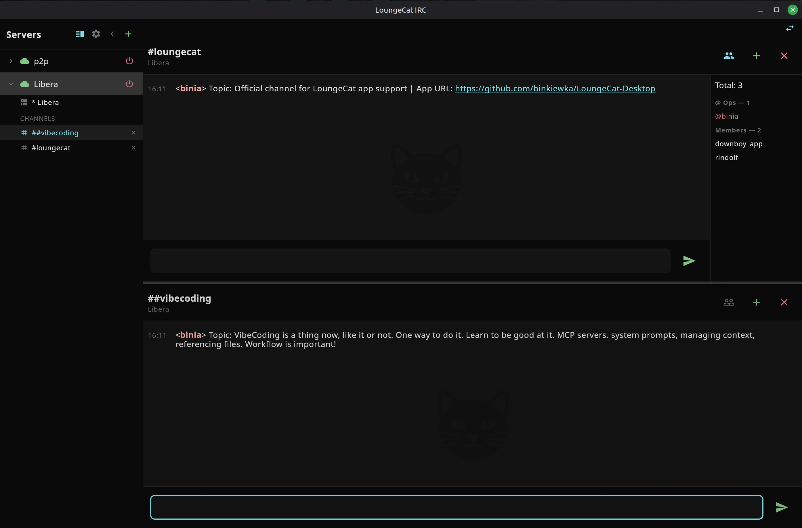 | 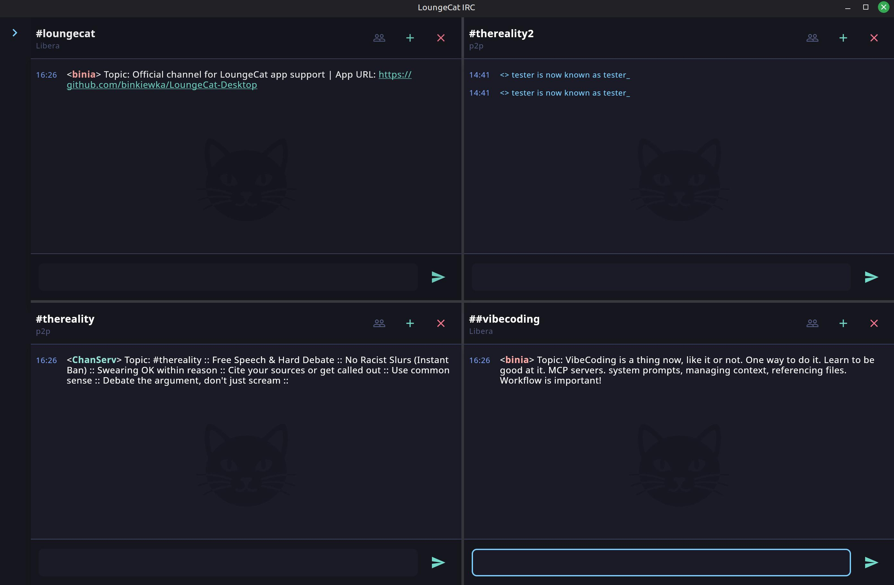 |

### ⚙️ Settings

| | | |
|:---:|:---:|:---:|
| 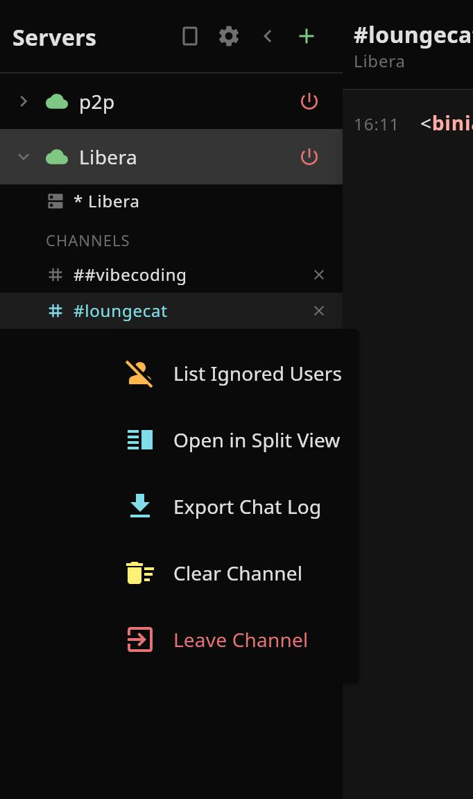 | 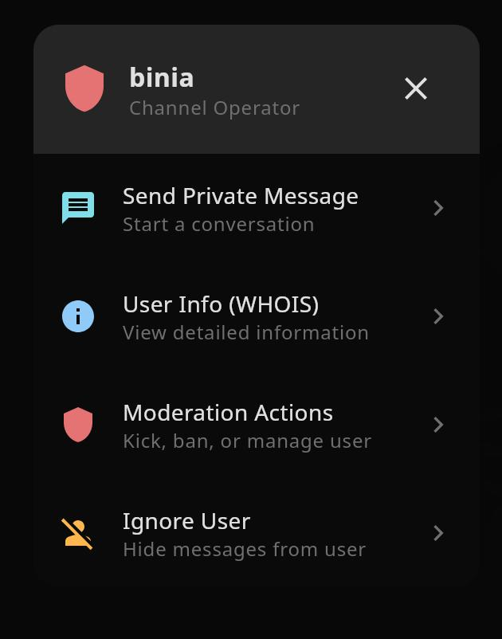 | 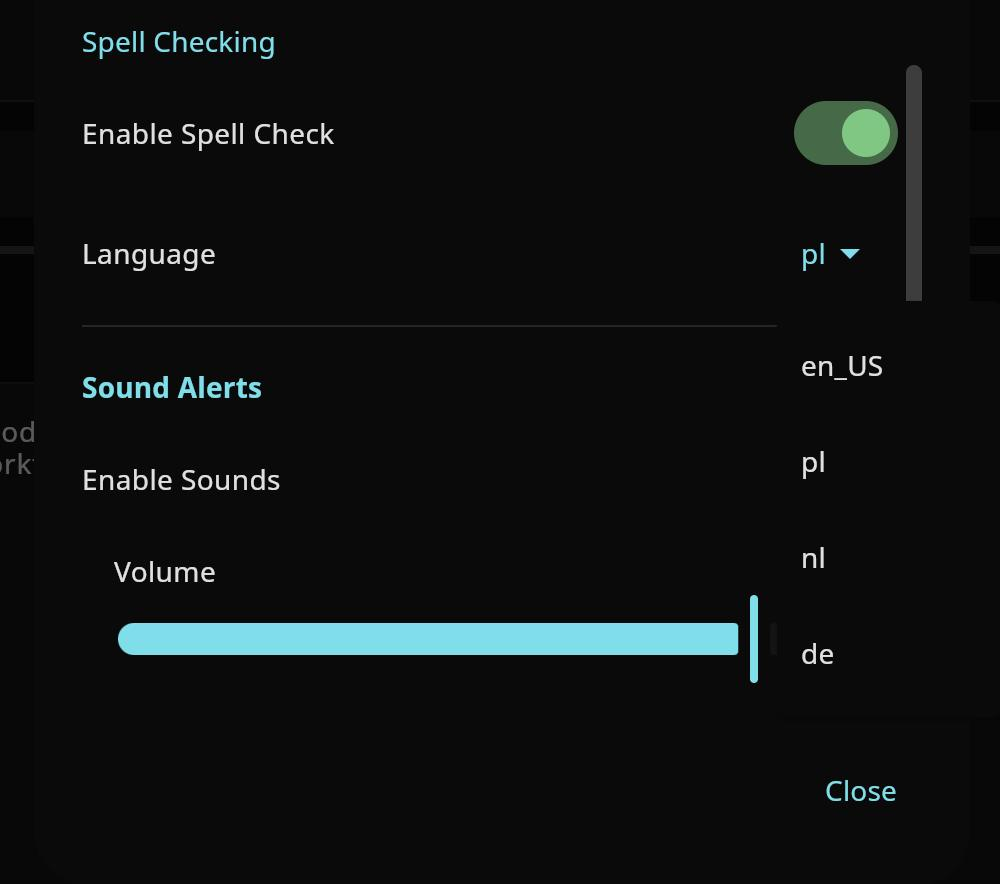 |
| 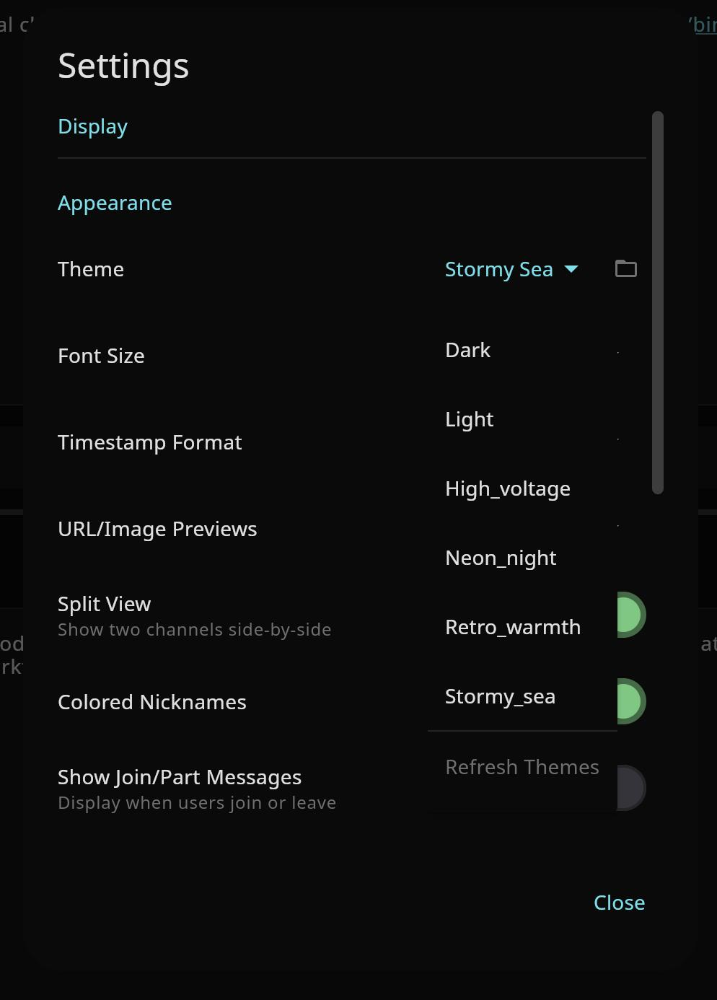 | 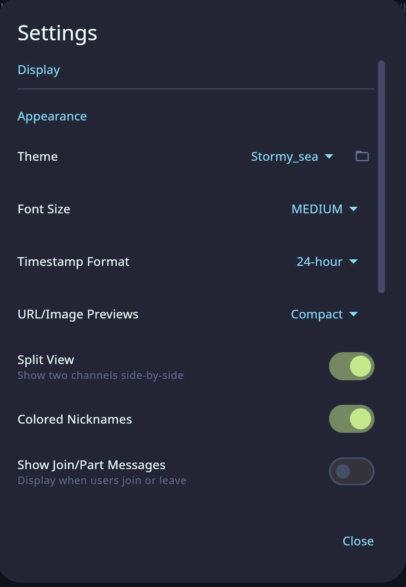 | 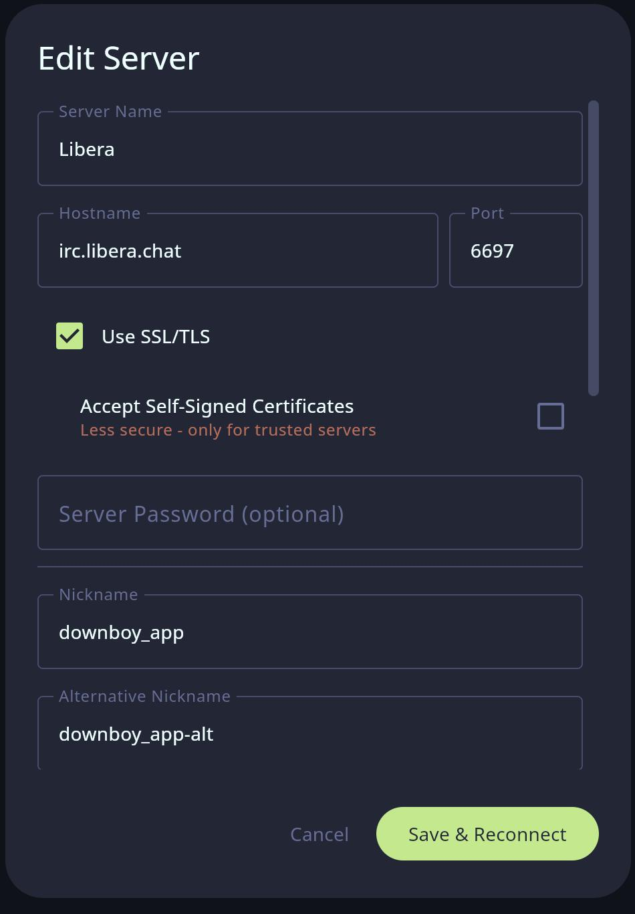 |

### 💬 Chat Experience

- **Spell Checking**:
  - Real-time spell checking powered by **LanguageTool**.
  - Support for multiple languages (English, Polish, German, Dutch).
  - Non-intrusive red squiggly underlines.
  - **"Fix All" Shortcut** (`Ctrl+M`) to quickly correct mistakes.
- **Smart Activity & Navigation**:
  - **Activity Indicators**: Subtle visual cues indicate channels with recent activity, separate from direct mentions.
  - **Unread Badges**: Distinct highlighting for unread messages and mentions.
  - **Persistent Scrollback**: Locally caches chat history so you never miss a conversation after a restart.
- **User List Improvements**:
  - **Away Status**: Users marked as 'Away' are visually dimmed. Hover to see their away message.
  - **WHOIS Tooltip**: Hover over any nickname to see their WHOIS information (real name, server, idle time) in a tooltip.
  - **Channel Modes**: Clear icons for Ops, Voice, and other user modes.
- **Tab Completion**: Intelligent auto-completion for nicknames, commands, and channels. (Tab / Shift+Tab to cycle).
- **History & Logging**:
  - **Persistent Scrollback**: Locally caches chat history so you never miss a conversation.
  - **History Replay**: Automatically loads the last `n` lines (configurable) when you join a channel.
  - **Topic Persistence**: Remembers channel topics even after restarting.
- **Smart Auto-Scroll**: Intelligent scrolling behavior that pauses when you read history and resumes when you catch up.
- **Pastebin Integration**: Automatically uploads messages exceeding your configured limit to `0x0.st`. (Default: 400 chars).
- **Search & Exports**:
  - **Searchable Logs**: Quickly find past messages in the app.
  - **Text Logging**: Automatically saves chat history to plain text files (`logs/Server/Channel.log`) for easy archiving.
  - **Export Chat**: Export current conversation logs to Text, HTML, or JSON formats.

### 🔌 Connectivity & Security

- **Multi-Protocol Support**:
  - **IRC**: Full support for standard IRC networks.
  - **Matrix (Experimental)**: Connect to Matrix homeservers using your access token.
- **Proxy Support**:
  - **SOCKS4/5** and **HTTP** proxy support for privacy and bypassing restrictions.
  - **Authentication**: Full support for proxy username/password authentication.
  - Configure proxies per-server for granular control.
  - Configure proxies per-server for granular control.
- **Privacy & Security**:
  - **Link Preview Privacy**:
    - **Proxy Support**: Fetch previews through a proxy to hide your IP.
    - **Configurable**: Choose whether to process links from everyone or just yourself.
  - **SSL/TLS**: Secure connections to IRC servers.
  - **Certificate Pinning**: Pin server SSL certificates for maximum security (TOFU - Trust On First Use).
  - **SASL Authentication**: Securely identify with services (NickServ) during connection.
- **Service Message Routing**: cleans up your chat by routing messages from NickServ, ChanServ, etc., to dedicated windows.
- **NickServ Integration**: Auto-identify with NickServ upon connecting.

### 🔔 Notifications & Alerts

- **Desktop Notifications**: Native system notifications for mentions and private messages.
- **Sound Alerts**: Customizable sound effects for mentions, messages, and connection events.
- **Update Notifier**: Automatically checks for new versions on startup and notifies you of updates.
- **Custom Highlights**: Define custom words or regex patterns to trigger highlights and notifications.

### ⚡ Power User Tools

- **Slash Commands**: Full support for standard commands like `/join`, `/part`, `/nick`, `/me`, etc.
- **Raw Commands**: Execute raw IRC protocol commands for advanced control.
- **On-Connect Commands**: Define custom raw commands to execute automatically after connection.
- **Server Configuration Import/Export**: Backup and share your server lists easily.
- **Channel Statistics**: View detailed user counts (Ops, Voiced, Away) and activity levels.
- **Keyboard Shortcuts**: Extensive keyboard navigation and control.

---

## 🚀 Installation & Running

We provide multiple ways to install and run LoungeCat to suit your platform and preference.

### 🐧 Linux

#### Option 1: AppImage (Recommended)

The AppImage is a universal package that runs on almost any Linux distribution.

1. Download the `.AppImage` file from the [Releases](https://github.com/binkiewka/LoungeCat-Desktop/releases) page.
2. Make it executable:

   ```bash
   chmod +x LoungeCat-x86_64.AppImage
   ```

3. Run it:

   ```bash
   ./LoungeCat-x86_64.AppImage
   ```

#### Option 2: DEB Package (Debian/Ubuntu)

For Debian, Ubuntu, Linux Mint, and derivatives.

1. Download the `.deb` file.
2. Install via terminal:

   ```bash
   sudo dpkg -i loungecat_1.0.0-1_amd64.deb
   sudo apt-get install -f  # To fix any missing dependencies
   ```

3. Launch "LoungeCat" from your application menu.

### 🪟 Windows

#### MSI Installer

1. Download the `.msi` installer.
2. Double-click to run the setup wizard.
3. Launch **LoungeCat** from the Start Menu.

### 🐳 Docker

Run LoungeCat in an isolated container. Requires Docker installed.

1. Clone the repository or download the `docker` directory.
2. Run the startup script (Linux):

   ```bash
   ./start-docker.sh
   ```

   *This script handles permissions to allow the container to display the UI on your X11 server.*

   **Or manually with Docker Compose:**

   ```bash
   xhost +local:docker  # Allow UI access
   docker compose -f docker/docker-compose.yml up --build
   ```

### 🕸️ Headless / Web Access

Run LoungeCat on a headless server and access it via your web browser (noVNC).

1. Run the headless startup script:

   ```bash
   ./start-headless.sh
   ```

2. Open your browser and navigate to:

   **[http://localhost:6080](http://localhost:6080)**

   *No password required by default.*

---

## 🛠 Configuration

### First Run

On the first launch, you will be prompted to add a server. You can choose from presets or enter details manually:

- **Server Name**: A friendly name for the network (e.g., "Libera.Chat").
- **Hostname**: The server address (e.g., `irc.libera.chat`).
- **Port**: Usually `6697` (SSL) or `6667` (Plain).

### Managing Settings

Access **Settings** via the gear icon in the sidebar.

- **Appearance**: Change themes (Dark/Light), font size, and message styling.
- **Timezone**: Select your preferred timezone for timestamps.
- **Spell Check**: Enable/disable, select language, and manage dictionary.
- **Notifications**: Toggle sounds and desktop alerts for specific events (Mentions, PMs, Highlights).
- **Advanced**: Manage ignored users, custom highlighting rules (Words/Regex), and proxy configurations.

---

## 🤝 Contributing

LoungeCat is open-source! Issues and Pull Requests are welcome.
